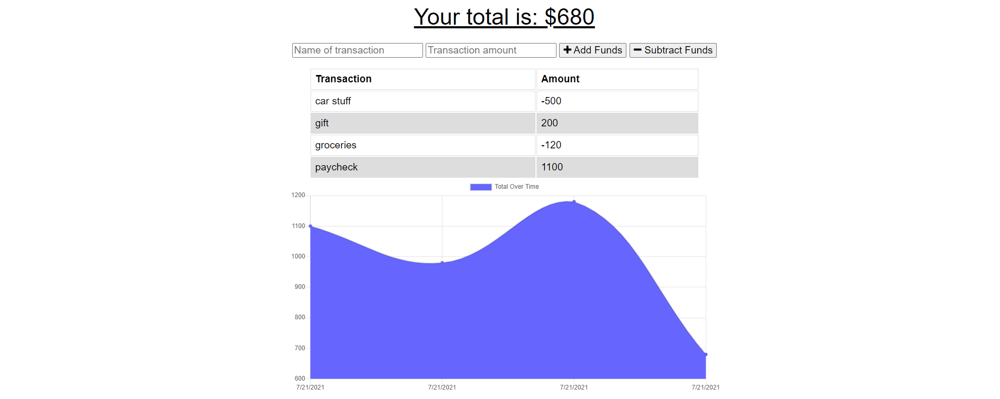

  # Budget Tracker

  

  ## Description
  
  A Progresssive Web Application to track a budget (income and outflow only). Has capacity to work with offline functionality

  ## Table of Contents
  
  * [Installation](#installation)
  * [Usage](#usage)
  * [Contributing](#contributing)
  * [Tests](#tests)
  * [Questions](#questions)
  
  ## Installation
  
  In addition to `node` there is a required `npm install` as well

  ## Usage
  
  This application is used to demonstrate capability in handling a manifest.json and an offline service-worker capacity. User can add and subtract from a local budget, and access the application while offline. Data is stored and edited with Mongo and Mongoose.

  ## Contributing
  
  No Contributors at this time

  ## Tests
  
  No tests at this time

  ## Questions
  
  Reach out to me at the links below with any questions, comments, or concerns:

  GitHub: [adamlsn](https://github.com/adamlsn) 
  email: [adamlsn@gmail.com](mailto:adamlsn@gmail.com)
  